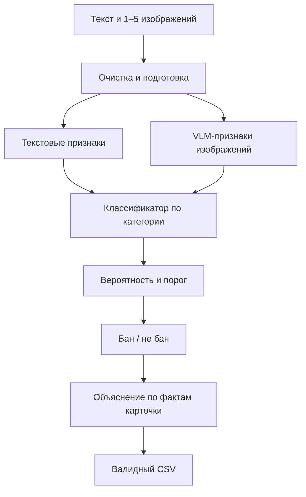

# E‑CUP 2026 «Контроль качества»: путь от нуля в ML до сильного решения

## Для кого и как пользоваться этим документом

Этот маршрут рассчитан на человека, который уверенно программирует, но почти не занимался машинным обучением. Цель двойная:

1. собрать корректное и конкурентоспособное решение E‑CUP;
2. на практике понять базовый ML‑цикл: данные → валидация → признаки → модель → метрика → анализ ошибок → улучшение → воспроизводимый inference.

Главное правило работы:

> Изучай один новый концепт, сразу применяй его к задаче, фиксируй результат и только потом переходи дальше.

Не нужно заранее проходить огромный курс по ML, выводить backpropagation или учиться обучать трансформер с нуля. Для этой задачи важнее правильно валидироваться, понимать F1, извлекать полезные признаки из текста и изображений, честно сравнивать эксперименты и собрать надёжный контейнер.

---

## 1. Что именно мы строим

Для каждого товара на вход приходят:

- `id`;
- `name` — название;
- `description` — описание;
- `category` — «БАД» или «Легковоспламеняющиеся»;
- от 1 до 5 изображений.

Нужно вернуть:

- бинарный вердикт: `бан` или `не бан`;
- конкретное объяснение длиной от 50 до 300 символов.

Полный pipeline выглядит так:



Это не одна магическая нейросеть. Это система из нескольких частей, которые можно улучшать и проверять отдельно.

---

# Часть I. Термины и интуиция

## 2. Данные и обучение

### Объект, признак и метка

- **Объект / sample** — одна строка, то есть один товар.
- **Метка / target / label** — правильный ответ из train: `1 = не бан`, `0 = бан`.
- **Признак / feature** — числовая информация, по которой модель принимает решение. Например, встречаемость фрагмента слова, длина описания или вектор изображения.
- **Матрица признаков `X`** — признаки всех объектов.
- **Вектор ответов `y`** — метки всех объектов.

Модель видит `X` и `y` на обучении и учится по признакам предсказывать метку новых товаров.

### Train, validation и test

- **Train** — данные, на которых модель подбирает веса.
- **Validation** — известные нам данные, которые модель не видела во время конкретного обучения. На них выбираются настройки и пороги.
- **Test** — закрытые данные организаторов. Их меток у нас нет.

Нельзя оценивать модель на тех же объектах, на которых она обучалась: модель может запомнить их и показать красивую, но бессмысленную цифру.

### Разбиение и cross-validation

Один train/validation split сильно зависит от случайности. Поэтому лучше использовать **cross-validation, CV**:

1. делим train на 5 частей — folds;
2. обучаемся на четырёх, проверяемся на пятой;
3. повторяем так, чтобы каждая часть один раз стала validation;
4. объединяем предсказания всех validation-частей.

Предсказание для объекта, полученное моделью, которая не обучалась на этом объекте, называется **OOF prediction — out-of-fold prediction**. Именно по OOF нужно выбирать пороги и веса ансамбля.

### Stratification

**Стратификация** сохраняет примерно одинаковые доли классов в каждом fold. Здесь её надо делать по комбинации `category + label`, иначе редкие примеры `не бан` у легковоспламеняющихся могут распределиться плохо.

### Group-aware split и утечка

В train много повторяющихся или почти повторяющихся карточек. Если копия товара попадёт в train, а другая копия — в validation, модель фактически увидит ответ заранее. Это называется **data leakage — утечка данных**.

Поэтому одинаковые нормализованные `name + description` должны получать один `group_id` и всегда попадать в один fold. Практический выбор:

```python
y_strat = df["category"].astype(str) + "__" + df["label"].astype(str)
groups = normalized_name_description_hash

splitter = StratifiedGroupKFold(
    n_splits=5,
    shuffle=True,
    random_state=42,
)
```

Это будет строже случайного split и заметно честнее покажет способность решения работать на новых товарах.

### Дисбаланс классов

**Class imbalance** означает, что один ответ встречается намного чаще другого. В уже разобранном train:

| Категория | `бан` | `не бан` | Всего |
|---|---:|---:|---:|
| БАД | 1 905 | 5 564 | 7 469 |
| Легковоспламеняющиеся | 5 304 | 198 | 5 502 |

У легковоспламеняющихся можно всегда говорить `бан` и получить около 96,4% accuracy. Но при этом не найти ни одного `не бан`, поэтому F1 положительного класса будет равен нулю. Это прекрасный пример, почему accuracy здесь почти бесполезна.

---

## 3. Метрика без магии

В этой задаче положительный класс — `label = 1 = не бан`.

### Четыре исхода

| Истина | Предсказание | Название | Смысл |
|---|---|---|---|
| `не бан` | `не бан` | TP | правильно пропустили |
| `бан` | `не бан` | FP | ошибочно пропустили |
| `не бан` | `бан` | FN | ошибочно заблокировали |
| `бан` | `бан` | TN | правильно заблокировали |

### Precision

Из всех товаров, которым модель сказала `не бан`, какая доля действительно была `не бан`:

\[
Precision = \frac{TP}{TP + FP}
\]

Высокий precision означает: модель редко ошибочно пропускает запрещённое.

### Recall

Из всех настоящих `не бан` сколько модель смогла найти:

\[
Recall = \frac{TP}{TP + FN}
\]

Высокий recall означает: модель редко блокирует разрешённое.

### F1

F1 — гармоническое среднее precision и recall:

\[
F1 = \frac{2 \cdot Precision \cdot Recall}{Precision + Recall}
\]

F1 высокая, только если одновременно приемлемы и precision, и recall.

### Итоговая метрика E‑CUP

F1 считается отдельно для каждой категории, затем две цифры усредняются:

\[
Score = \frac{F1_{БАД} + F1_{Легковоспламеняющиеся}}{2}
\]

Следствие: маленькая категория и редкий класс влияют на итог так же сильно, как большая категория. Поэтому отдельная работа над 198 примерами `не бан` у легковоспламеняющихся — один из главных источников улучшения.

Всегда логируй не одну общую цифру, а таблицу:

| Модель | F1 БАД | F1 легковоспл. | Среднее | Precision/Recall по категориям |
|---|---:|---:|---:|---|

---

## 4. Модель, веса, гиперпараметры и вероятность

- **Модель** — функция, превращающая признаки в предсказание.
- **Параметры / веса** — числа, которые модель сама подбирает по train.
- **Гиперпараметры** — настройки, которые задаём мы: например, сила регуляризации, размер изображения, `class_weight`.
- **Inference** — применение уже обученной модели к новым объектам.
- **Score / probability** — число, показывающее уверенность модели в `label=1`.
- **Threshold / порог** — граница, после которой score превращается в `1`.

Например:

```python
pred = int(probability >= threshold)
```

Порог `0.5` не является законом природы. При дисбалансе лучший F1 может достигаться на `0.17`, `0.73` или другой границе. Для каждой категории нужен собственный порог, подобранный по OOF.

Важно: `class_weight="balanced"` меняет процесс обучения, а threshold меняет финальное решение. Нужно честно сравнить комбинации и не считать, что class weights автоматически решают дисбаланс.

---

## 5. Признаки: TF‑IDF, embedding и OCR

### TF‑IDF

**TF‑IDF** превращает текст в большой разреженный числовой вектор. Высокий вес получают фрагменты, характерные для конкретного документа, но не встречающиеся абсолютно везде.

Есть два полезных вида:

- **word n-grams** — слова и пары слов;
- **character n-grams** — фрагменты из 3–6 символов.

Для русских карточек char n-grams особенно сильны: они переживают окончания, опечатки, слитное написание, HTML-мусор и варианты названий.

### Sparse matrix

TF‑IDF даёт **разреженную матрицу**: признаков могут быть сотни тысяч, но у конкретного товара ненулевых значений мало. Не превращай её в обычный dense-массив — память закончится.

### Logistic Regression

Несмотря на название, **логистическая регрессия** — классификатор. Она складывает признаки с обученными весами и превращает сумму в вероятность.

Почему она хороша здесь:

- быстро обучается;
- прекрасно работает с TF‑IDF;
- выдаёт probability для подбора порога;
- коэффициенты можно исследовать;
- легко запускать в контейнере.

Это не «игрушечный baseline». Для текстовой классификации хороший TF‑IDF + linear model часто очень силён.

### Embedding

**Embedding** — плотный числовой вектор фиксированной длины, описывающий смысл объекта. Похожие по смыслу товары должны иметь близкие векторы.

В отличие от TF‑IDF, embedding может уловить семантическую близость даже без точного совпадения слов. Но он иногда хуже замечает редкие конкретные маркеры, числа и фрагменты этикетки. Поэтому TF‑IDF и embeddings часто хорошо дополняют друг друга.

### OCR

**OCR** распознаёт текст на изображении. В этом датасете изображения содержат этикетки, состав, предупреждения и таблицы, поэтому OCR может превратить важную визуальную информацию в обычный текстовый признак.

Но OCR — не обязательный первый шаг. Он добавляет вычисления, ошибки распознавания и зависимости. Сначала нужно измерить text-only и официальный multimodal baseline, затем проверять, даёт ли OCR прирост на честном OOF.

---

## 6. LLM, VLM, Transformer и LoRA

### LLM

**Large Language Model** работает прежде всего с текстом. В решении она может генерировать объяснение по названию, описанию, категории, вердикту и извлечённым фактам.

### VLM

**Vision-Language Model** работает и с текстом, и с изображениями. Она может строить мультимодальные embeddings или генерировать текст с учётом изображения.

### Embedding model против generative model

- Embedding model выдаёт вектор; поверх него удобно обучить маленький классификатор.
- Generative model продолжает текст; её удобно использовать для объяснений или прямого ответа.

Для стабильной классификации схема `embedding → logistic regression → threshold` обычно проще и дешевле, чем просить LLM каждый раз свободно отвечать `бан/не бан`.

### Token и context

- **Token** — кусочек текста, с которым работает трансформер.
- **Context length** — максимальный объём входа.
- **Truncation** — обрезание слишком длинного входа.

Если описание обрезалось до важной части, модель её не увидит. Поэтому очистка HTML и разумный выбор частей длинного описания — полноценный ML-эксперимент.

### Fine-tuning и LoRA

- **Fine-tuning** — дополнительное обучение нейросети на своей задаче.
- **LoRA** — обучение небольших адаптеров вместо всех весов модели.

LoRA разрешена и потенциально полезна, но это последний, а не первый этап. Новичку она легко даст красивый train score, нестабильный validation, проблемы с GPU, архивом и воспроизводимостью. Делай LoRA только после готового CV, сильного ensemble и контейнера.

### Batch, VRAM, FP16/BF16 и OOM

- **Batch size** — сколько объектов обрабатывается одновременно.
- **VRAM** — память GPU.
- **FP16/BF16** — более компактные форматы чисел для быстрого inference.
- **OOM** — out of memory, нехватка памяти.

Больший batch обычно быстрее, пока помещается в память. Высокое разрешение и несколько изображений резко увеличивают расход VRAM и время.

---

## 7. Baseline, ablation и ensemble

- **Baseline** — первая полностью работающая точка отсчёта.
- **Ablation study** — выключаем одну часть системы и измеряем, насколько она важна.
- **Ensemble** — объединяем несколько моделей.
- **Overfitting** — модель или наши решения слишком подстроились под известные данные.

Пример ablation:

| Вариант | Что проверяет |
|---|---|
| Только TF‑IDF | насколько силён текст |
| Только VLM embedding | насколько силён общий multimodal-сигнал |
| TF‑IDF + VLM | дополняют ли модели друг друга |
| VLM без изображений | что реально добавили изображения |
| Все изображения против двух выбранных | оправдана ли цена обработки |

Ансамбль имеет смысл, когда модели делают разные ошибки. Если две модели почти всегда ошибаются на одних объектах, среднее их probabilities мало поможет.

---

## 8. Public/private leaderboard и воспроизводимость

Public содержит около 30% test, private — около 70%. Public score — шумная подсказка, а не настоящий validation.

Нельзя подбирать threshold, веса ансамбля и все решения только по public. Иначе это **leaderboard overfitting**: ты фактически много раз валидируешься на маленьком public и случайно подстраиваешься под него.

**Reproducibility** означает, что по коду, конфигу и зафиксированным артефактам можно повторить обучение и получить тот же pipeline. Для каждого эксперимента сохраняй:

- git commit;
- config;
- seed;
- fold assignment;
- OOF predictions;
- метрики;
- thresholds;
- время обучения и inference;
- название полученного артефакта.

---

# Часть II. Практическая roadmap

## 9. Архитектура проекта

Создай понятную структуру до экспериментов:

```text
quality-solution/
├── README.md
├── metadata.json
├── run.py
├── requirements.txt
├── configs/
│   ├── tfidf.json
│   └── multimodal.json
├── src/
│   ├── data.py
│   ├── normalize.py
│   ├── split.py
│   ├── metrics.py
│   ├── text_model.py
│   ├── vlm_features.py
│   ├── ensemble.py
│   ├── explanations.py
│   └── output_validation.py
├── scripts/
│   ├── train_text.py
│   ├── extract_embeddings.py
│   ├── train_embedding_model.py
│   └── evaluate_oof.py
├── artifacts/
├── tests/
└── reports/
    ├── experiments.csv
    └── error_analysis.csv
```

Train-код и inference-код должны быть разделены. На закрытом test не должно происходить переобучение; `run.py` только загружает готовые артефакты и делает prediction.

Не коммить сами данные и изображения в публичный репозиторий.

---

## 10. Фаза 0 — понять официальный baseline и добиться первого запуска

**Срок:** 0,5–1 день.

### Что изучить

- разница между training и inference;
- что такое сохранённый model artifact;
- основы `pandas.DataFrame`;
- как аргументы командной строки попадают в `run.py`.

### Что делает официальный baseline

1. Склеивает название, категорию и описание.
2. Находит изображения товара.
3. Получает совместный embedding текста и изображений через `Qwen3-VL-Embedding-2B`.
4. Использует отдельную logistic regression для каждой категории.
5. Применяет отдельные thresholds.
6. Генерирует объяснения через `Qwen3.5-4B`.
7. Формирует CSV.

### Что сделать руками

- распаковать архив в отдельную ветку;
- пройти `run.py` сверху вниз и подписать тип каждого объекта;
- запустить подготовку DataFrame на 10–20 строках;
- проверить, какие image paths нашлись;
- научиться загружать `joblib`-модель и получать probabilities;
- получить первый валидный CSV хотя бы на маленьком локальном наборе.

### Исправить сразу

Документация требует дефисные аргументы, baseline принимает underscore. Поддержи все варианты:

```python
parser.add_argument("--test_data_path", "--test-data-path", "-i", dest="test_data_path", required=True)
parser.add_argument("--output_path", "--output-path", "-o", dest="output_path", required=True)
```

Также убери мусор `__MACOSX` и `.DS_Store`, включи `local_files_only=True` для закрытого запуска и добавь понятные логи времени каждого этапа.

### Критерий готовности

Команда на маленьком наборе завершается без интернета, сохраняет ровно один ответ на каждый `id`, а отдельный валидатор принимает CSV.

---

## 11. Фаза 1 — EDA и честная схема проверки

**Срок:** 1–2 дня.

### Что изучить

- распределение классов;
- missing values;
- дубли;
- train/validation/test;
- leakage;
- StratifiedGroupKFold;
- confusion matrix, precision, recall, F1.

### Что посчитать

- число объектов по `category × label`;
- пустые названия и описания;
- длины текста до и после удаления HTML;
- число изображений на товар;
- размеры и форматы изображений;
- exact text duplicates;
- одинаковый текст с разными метками;
- частотные слова и char n-grams по каждому `category × label`.

### Нормализация текста

Создай несколько колонок, а не уничтожай исходник:

- `text_raw`;
- `text_clean` — HTML entities раскрыты, теги удалены, пробелы нормализованы;
- `name_clean`;
- `description_clean`;
- `group_key` — агрессивно нормализованный `name + description` для split.

Не удаляй цифры, проценты и знаки единиц измерения без эксперимента: они могут быть важными признаками.

### Построить folds один раз

Сохрани `id → fold` в файл и используй его во всех экспериментах. Иначе сравнивать модели будет невозможно: изменение score может оказаться просто другим разбиением.

Проверь для каждого fold:

- распределение четырёх комбинаций `category × label`;
- отсутствие пересечения `group_key` между train и validation;
- количество редких положительных примеров.

### Написать собственную функцию метрики

```python
def competition_score(df, predictions):
    scores = {}
    for category in df["category"].unique():
        mask = df["category"].eq(category)
        scores[category] = f1_score(
            df.loc[mask, "label"],
            predictions[mask],
        )
    return scores, sum(scores.values()) / len(scores)
```

Добавь unit-тесты на игрушечных массивах, включая случай без предсказанных единиц.

### Критерий готовности

Есть неизменяемые 5 folds, функция соревнования, отчёт о данных и доказательство отсутствия утечки exact text duplicates.

---

## 12. Фаза 2 — сильный text-only baseline

**Срок:** 2 дня.

### Что изучить

- bag of words;
- word и character n-grams;
- TF‑IDF;
- sparse matrices;
- logistic regression;
- регуляризация `C`;
- class weights;
- OOF prediction.

### Первая модель

Собери два векторизатора:

- word TF‑IDF: `(1, 2)` n-grams;
- char/char_wb TF‑IDF: примерно `(3, 5)` или `(3, 6)`.

Затем объедини признаки и обучай отдельную logistic regression для каждой категории. Начни с маленьких ограничений по features, чтобы быстро проверить pipeline, затем увеличь.

Минимальная сетка экспериментов:

| Параметр | Значения |
|---|---|
| Текст | raw / clean / name с повышенным весом |
| Признаки | word / char / word+char |
| `C` | 0.25 / 1 / 4 |
| `class_weight` | `None` / `balanced` |

Не запускай сразу все комбинации. Сначала найди лучший вид текста и признаков, затем подстрой `C` и веса.

### Как «повысить вес» названия

Простой baseline: повторить название два раза перед описанием. Более чистый вариант — отдельный TF‑IDF для `name` и `description` через `ColumnTransformer` / `FeatureUnion`.

### Подбор thresholds

1. Собери OOF probability для каждого объекта.
2. Для каждой категории отдельно перебери threshold.
3. Выбери максимум F1.
4. Посмотри не только максимум, но и устойчивость рядом с ним.

```python
for t in np.linspace(0.01, 0.99, 199):
    pred = (oof_prob >= t).astype(np.int8)
    score = f1_score(y, pred)
```

Если `0.41`, `0.42`, `0.43` дают почти одинаковый F1, выбирай середину устойчивой области, а не случайный острый пик.

### Исследование коэффициентов

Выведи top positive и negative n-grams для каждой категории. Это помогает:

- понять, чему научилась модель;
- найти leakage или мусор;
- увидеть полезные продуктовые паттерны;
- строить осмысленную таксономию ошибок.

### Критерий готовности

Есть полностью OOF text-only результат, отдельные thresholds, confusion matrices и сохранённый pipeline, который принимает сырые строки без ручной подготовки.

---

## 13. Фаза 3 — системный анализ ошибок

**Срок:** 1–2 дня, затем повторять после каждой сильной модели.

Смотреть только на средний F1 недостаточно. Создай `error_analysis.csv`:

| Поле | Зачем |
|---|---|
| `id`, `category`, `label` | идентификация |
| `oof_prob`, `pred` | уверенность и ошибка |
| `name`, `clean_text` | текстовые доказательства |
| `num_images` | доступность визуального сигнала |
| `error_type` | FP/FN/TP/TN |
| `duplicate_group_size` | риск запоминания |
| `manual_reason` | твоя короткая причина ошибки |
| `image_needed` | могло ли изображение изменить ответ |

### Что просмотреть вручную

1. Все 198 редких `не бан` у легковоспламеняющихся — это реально обозримое число.
2. 50 самых уверенных FP и FN по каждой категории.
3. Объекты, где text model и VLM впоследствии расходятся.
4. Группы с одинаковым текстом и разными labels.

### Создать таксономию ошибок

Не подгоняй правила по отдельным `id`. Группируй причины, например:

- важный факт есть только на изображении;
- название вводит в заблуждение, описание уточняет;
- HTML/обрезание спрятало признак;
- очень короткая карточка;
- противоречие между текстом и упаковкой;
- редкий тип товара;
- возможный шум метки;
- почти дубликат с различающейся деталью.

Каждое следующее улучшение должно быть направлено на массовую категорию ошибок, а не на одну красивую карточку.

### Критерий готовности

Ты можешь объяснить, почему модель ошибается, минимум для 70–80% её наиболее уверенных ошибок, и назвать три наиболее ценных направления улучшения.

---

## 14. Фаза 4 — воспроизвести multimodal baseline

**Срок:** 1–2 дня.

### Что изучить

- tokenizer/processor;
- embedding;
- batching;
- mixed precision;
- pooling;
- GPU memory;
- разница text-only и text+images.

### Эксперименты

С одним и тем же CV сравни:

1. Qwen embedding только по тексту.
2. Qwen embedding по тексту + первому изображению.
3. Текст + всем изображениям на preset `S`.
4. Текст + всем изображениям на preset `M`.

Для каждого варианта сохрани embeddings на диск. Не пересчитывай дорогие признаки при каждом обучении logistic regression.

На embeddings снова обучи отдельную logistic regression по категориям и получи OOF probabilities. Не оценивай embedding по split, который отличается от TF‑IDF.

### Что измерять кроме F1

- время на один объект;
- peak VRAM;
- размер кэша embeddings;
- число OOM/fallback;
- прирост F1 по категориям;
- сколько ошибок text-only исправлено изображениями и сколько новых создано.

### Критерий готовности

Есть честная таблица `text-only Qwen` против `text+images Qwen`, а также понимание, оправдывает ли визуальный сигнал стоимость inference.

---

## 15. Фаза 5 — сделать изображения действительно полезными

**Срок:** 2–3 дня. Выполнять только после предыдущих фаз.

Baseline уменьшает изображения, хотя на них много мелкого текста. Но просто поднять разрешение всем 5 изображениям может не уложиться во время.

### Стратегия A: выбор информативных изображений

Для каждого товара оцени:

- разрешение;
- резкость;
- долю мелких границ/текста;
- различие с уже выбранными картинками;
- является ли изображение лицевой или обратной стороной упаковки.

Сравни `все изображения` против `лучшие 2`. Если качество почти одинаково, два изображения дадут большой выигрыш по времени.

### Стратегия B: отдельные embeddings

Вместо одного общего вектора попробуй сохранить:

- text-only embedding;
- multimodal embedding;
- усреднённый per-image embedding;
- разницу или cosine similarity между text и image представлением.

Это позволяет классификатору понять, когда картинка подтверждает текст, а когда добавляет новое.

### Стратегия C: OCR / visual evidence

Если разрешённый open-source OCR или VLM-транскрипция укладывается в ограничения:

1. извлеки текст с 1–2 информативных изображений;
2. добавь его отдельным полем, не смешивая вслепую с description;
3. обучи TF‑IDF на `name`, `description`, `ocr_text`;
4. сделай ablation без OCR;
5. вручную оцени качество OCR минимум на 100 изображениях.

Не очищай OCR слишком агрессивно: фрагменты слов, цифры и проценты могут быть полезны char TF‑IDF.

### Стратегия D: крупные crop'ы

Если важная маркировка исчезает после resize, сравни:

- целое изображение;
- центр + четыре крупных участка;
- только верх/низ или front/back, если это подтверждается анализом.

Каждый crop — дополнительная цена. Используй его только при измеримом OOF-приросте на подмножестве `image_needed`.

### Критерий готовности

Есть конкретный ответ в цифрах: какие изображения, какое разрешение и какой способ их представления дают лучший прирост на секунду inference.

---

## 16. Фаза 6 — ensemble и работа с редким классом

**Срок:** 1–2 дня.

### Начни с простого weighted average

Для каждой категории отдельно:

\[
p_{final} = w \cdot p_{tfidf} + (1-w) \cdot p_{vlm}
\]

Перебери `w` по OOF, затем для каждого `w` подбери threshold. Можно добавить OCR-модель третьим компонентом, но не делай огромную сетку.

### Более продвинутый вариант — stacking

Meta-model получает OOF probabilities базовых моделей и несколько надёжных признаков. Важно: учить meta-model можно только на OOF-прогнозах, иначе получится leakage.

Для маленького числа моделей weighted average обычно устойчивее и проще.

### Редкий `не бан` у легковоспламеняющихся

Приоритеты:

1. ручная таксономия всех положительных примеров;
2. group-aware CV;
3. `class_weight` и threshold;
4. disagreement text/VLM;
5. простые признаки под массовые обнаруженные паттерны;
6. только затем oversampling или более сложная модель.

Не начинай со SMOTE: синтетические точки в embedding-пространстве не гарантируют реалистичные товары и часто уступают хорошему thresholding.

### Проверка устойчивости

Для финального ensemble смотри:

- mean и standard deviation F1 по folds;
- F1 на каждом fold отдельно;
- изменение score при небольшом сдвиге threshold;
- bootstrap confidence interval, если успеваешь;
- результаты на группах с дублями и без дублей.

### Критерий готовности

Ensemble улучшает OOF не только в среднем, но и на большинстве folds, а выбранный threshold не является одиночным случайным пиком.

---

## 17. Фаза 7 — качественные объяснения

**Срок:** 1–2 дня.

Leaderboard считает F1, но для финалистов объяснения отдельно проверяются LLM-судьёй вместе с качеством решения. Значит, объяснения не должны разрушать классификационный pipeline, но откладывать их до последнего часа тоже нельзя.

### Раздели решение и объяснение

Классификатор сначала жёстко выбирает вердикт. Генератор не должен заново решать задачу — он должен объяснить уже выбранный ответ по фактам карточки.

В prompt передавай:

- категорию;
- название;
- очищенное описание;
- короткое OCR/visual evidence, если оно есть;
- финальный вердикт;
- требование привести 1–2 конкретных факта;
- запрет менять вердикт и писать общие фразы;
- требование вернуть только комментарий.

### Хорошее объяснение

Хороший комментарий:

- ссылается на конкретный состав, назначение, маркировку или изображённый товар;
- согласован с вердиктом;
- не выдумывает отсутствующий факт;
- не содержит «модель считает», «я LLM» и других заглушек;
- не повторяет полностью название;
- укладывается в 50–300 символов.

### Снижать hallucinations

- `do_sample=False`;
- низкая вариативность;
- просить использовать только предоставленные факты;
- при низкой уверенности формулировать «В карточке указано…», а не делать внешние юридические заявления;
- после генерации проверять упомянутые числа и ключевые сущности против входа;
- иметь безопасный evidence-based template fallback.

### Ручной аудит

Возьми минимум 100 объектов, сбалансированных по:

- двум категориям;
- двум вердиктам;
- TP/FP/FN/TN по OOF;
- высокой и низкой уверенности;
- наличию и отсутствию визуального доказательства.

Оцени:

- соответствие вердикту;
- конкретность;
- фактическую опору;
- галлюцинации;
- читаемость;
- длину.

### Важное правило конкурса

Не используй ChatGPT или другую закрытую проприетарную модель для создания synthetic labels или обучающих объяснений. Если обучаешь LoRA на сгенерированных объяснениях, их должен производить разрешённый open-source pipeline, а процесс должен быть воспроизводим.

### Критерий готовности

На ручной выборке нет противоречий вердикту, почти нет необоснованных фактов, отсутствуют filler-фразы, а формат проходит автоматически.

---

## 18. Фаза 8 — строгий output validator

**Срок:** несколько часов. Это P0, а не косметика.

Проверить перед сохранением:

- столбцы ровно `id,result`;
- число строк равно числу входных товаров;
- каждый входной `id` встретился ровно один раз;
- нет лишних `id`;
- нет `NaN`;
- строка начинается с `<комментарий>`;
- ровно один `<вердикт>`;
- нет закрывающих тегов;
- verdict строго `бан` или `не бан`;
- длина именно комментария — 50–300 символов Python `len`, а не токенов;
- CSV повторно читается `pandas` без изменения числа строк.

Добавь тесты на:

- запятые и кавычки в комментарии;
- переносы строк;
- кириллицу;
- пустой результат;
- комментарий 49, 50, 300 и 301 символ;
- duplicate id;
- переставленный порядок строк.

Если генератор упал или вернул мусор, pipeline должен использовать конкретный шаблон из доступных фактов, а не падать целиком.

---

## 19. Фаза 9 — container, offline inference и runtime

**Срок:** 2 дня плюс ранний smoke submission.

Ограничения из описания:

- запуск без интернета;
- 20 CPU cores;
- 100 GB RAM;
- H100 80 GB;
- Check: 3 минуты на 10 объектов;
- Public: 20 минут примерно на 1 600 объектов;
- Private: 40 минут примерно на 3 800 объектов;
- архив решения до 5 GB;
- Docker image до 15 GB.

### Инженерный checklist

- все модели открываются из `SHARED_MODELS_PATH` или лежат в архиве;
- никакого скачивания в `run.py`;
- `local_files_only=True`;
- пути строятся относительно файла запуска, а не текущей директории;
- аргументы поддерживают формы из документации и baseline;
- отсутствующее описание заменяется пустой строкой;
- пустая папка изображений даёт text-only fallback;
- битое изображение логируется и пропускается;
- OOM уменьшает batch или число изображений;
- модель загружается один раз;
- inference использует `eval()` и `torch.no_grad()` / `inference_mode()`;
- randomness зафиксирована;
- в stdout есть этап, число объектов, время, peak memory, но нет гигантских prompt'ов;
- временные файлы не растут бесконтрольно.

### Runtime budget

Разложи общий лимит:

| Этап | Цель |
|---|---:|
| Загрузка моделей | как можно меньше, особенно ради Check 3 мин |
| Чтение/resize изображений | измерить отдельно |
| Embeddings | главный GPU-бюджет |
| Классификатор | почти бесплатно |
| Генерация объяснений | второй главный GPU-бюджет |
| CSV + validation | секунды |

Замеряй throughput на 10, 100 и 500 объектах. Не экстраполируй только по 10: загрузка модели и batching искажают результат.

### Критерий готовности

Контейнер дважды подряд автономно проходит локальный smoke test, результат детерминирован, а измеренный runtime имеет минимум 20–25% запаса.

---

## 20. Фаза 10 — LoRA только при наличии времени

**Срок:** 2–4 дня, опционально.

Переходить сюда можно, только если:

- folds и OOF зафиксированы;
- сильный TF‑IDF и VLM ensemble уже готовы;
- контейнер прошёл платформу;
- есть автоматический validator;
- понятна массовая ошибка, которую LoRA должна исправить.

### Безопасная постановка эксперимента

1. Выбери одну разрешённую модель до 4B.
2. Сначала обучи только classification-адаптер или короткий structured output.
3. Оставь целый fold полностью невидимым.
4. Сравни не с нулём, а с текущим ensemble.
5. Проверь runtime, размер adapters и воспроизводимость.
6. Для обучающих объяснений используй только разрешённые открытые источники и воспроизводимый pipeline.

Если LoRA даёт маленький нестабильный прирост, не усложняй финальное решение. На хакатоне надёжный ensemble часто ценнее хрупкой fine-tuned модели.

---

# Часть III. Календарный план до дедлайна

## 21. План на 10–30 августа 2026

В юридических правилах загрузка решений заканчивается **30 августа в 23:59 МСК**, а выбрать до двух финальных решений нужно **31 августа до 12:00 МСК**. Внутренний дедлайн лучше поставить на вечер 29 августа.

| Даты | Работа | Результат дня |
|---|---|---|
| 10–11 авг | baseline, структура проекта, первый CSV, validator | технически рабочее решение |
| 12–13 авг | EDA, normalizer, groups, 5 folds, metric tests | честная среда экспериментов |
| 14–15 авг | word/char TF‑IDF, logistic regression, OOF thresholds | сильный text-only baseline |
| 16 авг | error analysis, все редкие positive, taxonomy | список реальных слабостей |
| 17–18 авг | Qwen text-only и multimodal embeddings | честное сравнение image contribution |
| 19–20 авг | image selection/resolution, при успехе OCR/crops | эффективная image-ветка |
| 21–22 авг | ensemble, per-category weights и thresholds | кандидат классификатора |
| 23 авг | ранний полный container submission | подтверждённый запуск платформой |
| 24–25 авг | объяснения, factual prompt, fallback, ручной аудит | качественные comments |
| 26 авг | ablations, fold stability, runtime profile | обоснованный финальный pipeline |
| 27–28 авг | Docker hardening, edge cases, повторные запуски | release candidate |
| 29 авг | две осмысленные финальные версии, freeze | готовность без ночного аврала |
| 30 авг | только исправление критических проблем | финальная загрузка до 23:59 МСК |
| 31 авг | выбрать 2 решения | выбор до 12:00 МСК |

### Режим одного рабочего дня

- 60–90 минут: изучить один концепт;
- 3–4 часа: реализовать один эксперимент;
- 1–2 часа: дождаться вычислений, разобрать ошибки, заполнить журнал;
- 30 минут: тесты, commit, план следующей гипотезы.

Если эксперимент дорогой, запускай его на ночь только после smoke test на маленьком подмножестве.

---

## 22. Очередь экспериментов в правильном порядке

| ID | Гипотеза | Изменяется ровно одно | Приоритет |
|---|---|---|---:|
| E00 | официальный baseline запускается | ничего | P0 |
| E01 | clean text лучше raw | preprocessing | P0 |
| E02 | char TF‑IDF сильнее word | feature type | P0 |
| E03 | word+char дополняют друг друга | объединение features | P0 |
| E04 | отдельные category models лучше общей | model split | P0 |
| E05 | OOF threshold улучшает 0.5 | threshold | P0 |
| E06 | multimodal embedding улучшает text-only | images on/off | P1 |
| E07 | TF‑IDF + VLM лучше каждого отдельно | ensemble weight | P1 |
| E08 | два выбранных изображения не хуже пяти | image selection | P1 |
| E09 | higher-resolution crop исправляет image-needed FN/FP | resolution/crop | P1 |
| E10 | OCR добавляет полезный сигнал | OCR field | P2 |
| E11 | evidence prompt улучшает комментарии | prompt | P1 |
| E12 | LoRA исправляет конкретный массовый тип ошибок | adapter | P3 |

Для каждого эксперимента до запуска запиши:

1. гипотезу;
2. одну изменяемую вещь;
3. ожидаемый эффект;
4. критерий успеха;
5. максимальное допустимое время.

После запуска запиши OOF, две category F1, fold std, runtime и вывод. Отрицательный результат — тоже результат, если ты понял, почему ветку не надо тащить в контейнер.

---

## 23. Как тратить пять submissions в день

Не отправляй пять почти одинаковых архивов без локальной гипотезы.

Рекомендуемая дисциплина:

- первый ранний submission — проверить интерфейс, образ и runtime;
- затем отправлять только версии с завершённым OOF-экспериментом;
- максимум 1–2 содержательных submission в обычный день;
- оставлять слот для исправления container failure;
- логировать submission ID, commit, config, OOF, public score, runtime и ошибку платформы;
- не менять threshold по каждому движению public score.

Public полезен как sanity check: если OOF вырос сильно, а public резко упал, ищи distribution shift, bug или leakage. Один небольшой конфликт может быть шумом.

---

## 24. Какие две финальные версии выбрать

Не обязательно выбирать две версии с почти одинаковым поведением.

Разумная пара:

1. **Robust candidate** — стабильный TF‑IDF + multimodal ensemble, лучшие OOF и fold stability, консервативный runtime.
2. **Diverse candidate** — более image-aware или альтернативный threshold/ensemble, который делает заметно другие ошибки и имеет подтверждённый CV.

Не выбирай рискованный контейнер только из-за +0.002 public, если он иногда падает или не укладывается во время.

---

# Часть IV. Приоритеты и анти-паттерны

## 25. Если времени мало

### P0 — обязательно

- рабочий baseline;
- точная metric function;
- group-aware CV;
- word+char TF‑IDF;
- отдельные модели и thresholds;
- output validator;
- ранний container submission;
- журнал экспериментов.

### P1 — главный конкурентный прирост

- честные multimodal embeddings;
- ensemble;
- анализ всех редких positives;
- image selection;
- конкретные объяснения;
- runtime hardening.

### P2 — только после измерений

- OCR;
- crops;
- retrieval по train prototypes;
- stacking;
- ручные структурные признаки.

### P3 — исследовательский бонус

- LoRA;
- сложная multimodal fine-tuning;
- distillation;
- несколько генеративных моделей.

---

## 26. Что почти наверняка не стоит делать новичку в начале

- оптимизировать accuracy;
- использовать случайный row split при дублях;
- выбирать threshold по public leaderboard;
- обучать и оценивать meta-model на predictions тех же train-объектов;
- менять пять вещей в одном эксперименте;
- сразу fine-tune VLM;
- запускать OCR на всех картинках без замера пользы и времени;
- конвертировать sparse TF‑IDF в dense matrix;
- слепо использовать `class_weight="balanced"` без OOF threshold;
- считать любой HTML мусором и удалять вместе с полезными числами;
- просить LLM одновременно решить задачу и свободно объяснить решение;
- использовать filler вроде «я LLM»;
- надеяться, что Docker заработает в последний день;
- использовать закрытую модель для synthetic labels или обучающих explanations;
- публиковать конкурсные данные или решение, если это запрещено правилами.

---

## 27. Definition of Done

### ML

- [ ] folds неизменны и group-aware;
- [ ] есть OOF predictions каждой модели;
- [ ] score считается отдельно по категориям;
- [ ] thresholds выбраны по OOF;
- [ ] есть confusion matrices и error taxonomy;
- [ ] ensemble прошёл ablation;
- [ ] редкий класс исследован вручную;
- [ ] финальный результат устойчив по folds.

### Объяснения

- [ ] вердикт выбирает классификатор, а не генератор;
- [ ] комментарий опирается на факты карточки;
- [ ] нет противоречий verdict/comment;
- [ ] нет hallucinations на ручной аудит-выборке;
- [ ] длина 50–300 символов;
- [ ] есть безопасный fallback.

### Инженерия

- [ ] поддерживаются `--test_data_path/-i` и `--output-path/-o`;
- [ ] inference полностью offline;
- [ ] все модели и библиотеки доступны;
- [ ] отсутствующие/битые изображения не роняют run;
- [ ] CSV проходит строгий validator;
- [ ] runtime имеет запас;
- [ ] archive < 5 GB;
- [ ] Docker image < 15 GB;
- [ ] два повторных запуска дают одинаковый результат;
- [ ] ранняя версия уже прошла платформу.

### Исследовательская культура

- [ ] каждый эксперимент имеет гипотезу;
- [ ] изменяется одна важная вещь;
- [ ] результаты записаны;
- [ ] артефакт связан с commit/config;
- [ ] можно объяснить, почему финальная система устроена именно так.

---

## 28. Что ты реально выучишь после этой задачи

Если пройти маршрут честно, ты не просто «потрогаешь нейросеть», а освоишь полноценный прикладной ML workflow:

- постановку supervised classification;
- EDA и очистку реальных грязных данных;
- дисбаланс классов;
- precision, recall, F1 и thresholding;
- leakage и group-aware cross-validation;
- TF‑IDF и linear models;
- embeddings и мультимодальные модели;
- OOF ensemble;
- error analysis и ablation studies;
- работу с GPU inference и memory budget;
- генерацию grounded explanations;
- воспроизводимость;
- offline Docker deployment.

Это уже хорошая фундаментальная база для следующего ML-проекта. Самая ценная часть — не знание названий моделей, а привычка отличать настоящий прирост от утечки, случайности и красивой демонстрации.

---

## 29. Самый первый конкретный шаг

Не начинай с OCR или LoRA. Первый рабочий день должен закончиться четырьмя артефактами:

1. `folds.csv` с честным разбиением;
2. `metrics.py` с unit-тестами;
3. валидный CSV от официального baseline на маленьком наборе;
4. `experiments.csv` с первой строкой `E00`.

После этого следующий конкретный milestone — OOF word+char TF‑IDF с отдельными category thresholds. Только когда он готов, изображения можно добавлять осмысленно и измерять их реальную пользу.

---

## Примечания по исходным материалам

- Формат, вычислительные ограничения, три стадии проверки и требования к объяснениям сверены с описанием задачи.
- Сроки загрузки и выбора финальных решений сверены с юридическими правилами конкурса.
- Пайплайн Qwen embedding → category logistic regression → Qwen explanation сверён с официальным baseline-архивом.
- На странице описания есть формулировка про top-15 перед ревью и последующий выбор пяти финалистов; юридический документ описывает отбор иначе. Для организационных решений безопаснее запросить у организаторов письменное уточнение.

